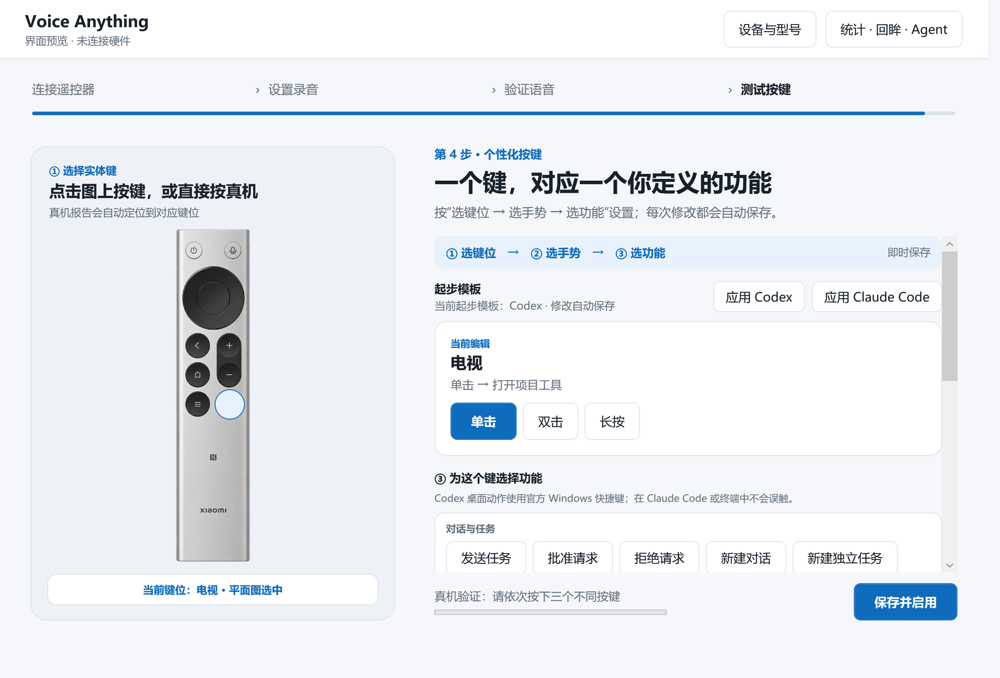
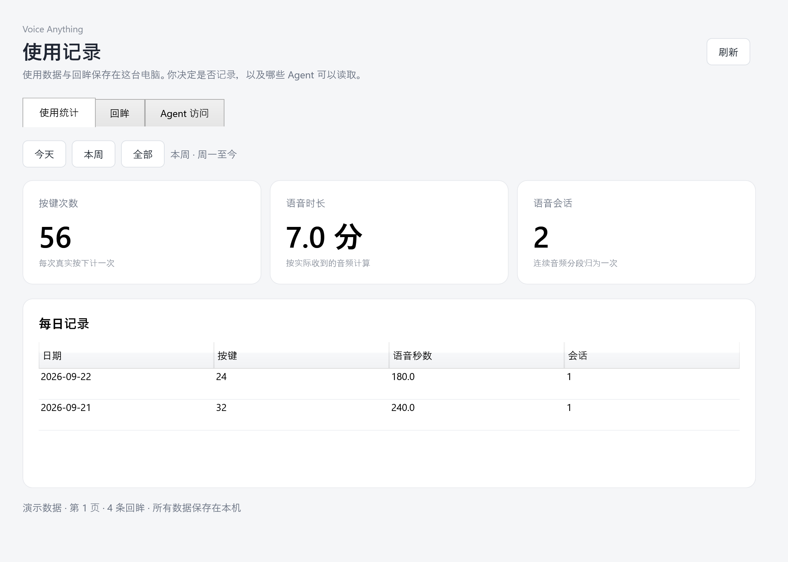
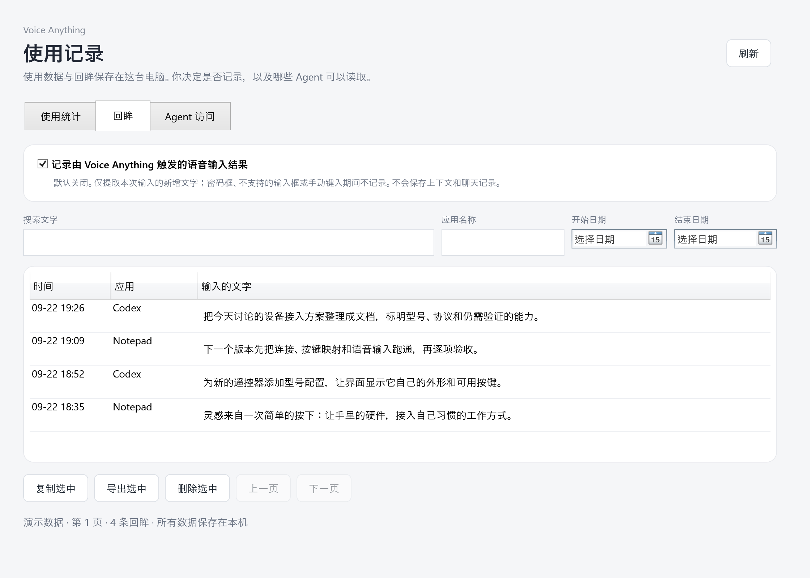

<div align="center">

# Voice Anything

**让手里的遥控器，成为语音输入与应用操作的入口。**

Windows · macOS · 本地回眸 · 只读 MCP · 可贡献的硬件型号

[上手与构建](docs/BUILD.md) · [接入硬件](CONTRIBUTING.md) · [隐私与 MCP](docs/PRIVACY.md) · [验收状态](docs/ACCEPTANCE.md)

</div>



选择型号，让界面显示它自己的外形与按键。按住说话，松开结束；让单击、双击和长按执行你习惯的动作。

> 当前是开发预览。Windows 的自动检查与原生界面渲染已通过；macOS 尚待原生构建和真机验收。通过两端验收后才发布正式版本。当前内置适配器为 Xiaomi ATVV，其他协议需要贡献对应适配器。

## 把表达留下来，由你决定

| 使用统计 | 回眸 |
| --- | --- |
|  |  |
| 查看今天、本周和每天的按键次数、音频时长。 | 搜索输入过的文字，按应用和日期筛选，复制、导出或删除。 |

回眸默认关闭。开启后，通过系统公开的辅助功能接口提取本次语音新增的文字。不支持的输入框会提示未记录。Voice Anything 不提供云端转写服务，语音识别由你选择的输入法完成。

本地 Agent 可通过 MCP 查询回眸与统计。每个客户端独立授权，随时撤销；接口不提供修改记录、执行命令或任意文件访问能力。

以上是应用本身渲染的 Windows 原生界面，记录页使用明确标注的演示数据。macOS 截图将在原生验收后补充。

## 支持到哪里

| 平台 | 当前接入路径 | 验证边界 |
| --- | --- | --- |
| Windows 11 x64 | RC003 / RC003MS、ATVV 16 kHz ADPCM、VB-CABLE、受指纹校验保护的 HID 桥 | 新版已通过自动检查；设备切换与完整语音流程仍需真机验收 |
| macOS 14+ | 复用公开版 CoreBluetooth、IOHID 与 CoreAudio；新增共享型号配置、统计、回眸、MCP | 新增代码尚未在 macOS 编译和运行 |

型号包描述外形、按键、手势和能力。相同适配器支持的硬件可复用接入代码；相似协议仍要核对实际报文、音频格式与系统驱动。导入配置不会自动变成“已验证支持”。

## 开发

Windows 需要 .NET 10 SDK：

```powershell
./Windows/scripts/test-baseline.ps1
dotnet run --project Windows/src/SayAll.Windows
```

macOS 需要 Swift 6.2+、Xcode 和 .NET 10 SDK：

```sh
cd macOS
swift test
bash scripts/build-app.sh
```

完整安装包、音频设备准备、原生截图命令见[构建说明](docs/BUILD.md)。新增硬件从一份 [profile.json](devices/xiaomi-rc003/profile.json) 开始，详见[贡献指南](CONTRIBUTING.md)。

## 来源与许可

基于 [HD838A/remote-mic-app（SayAll）](https://github.com/HD838A/remote-mic-app) 的公开 macOS 实现，以及本项目此前开发的 Windows 移植版。感谢上游在 ATVV、蓝牙、音频和原生交互上的工作。

程序代码按 [GPL-3.0-only](LICENSE.md) 发布。原 SayAll 专有应用图标不包含在此派生版本中。硬件图片和第三方组件的许可见 [THIRD_PARTY_NOTICES.md](THIRD_PARTY_NOTICES.md)；两端差异与改动范围见[来源说明](docs/ORIGIN.md)。
